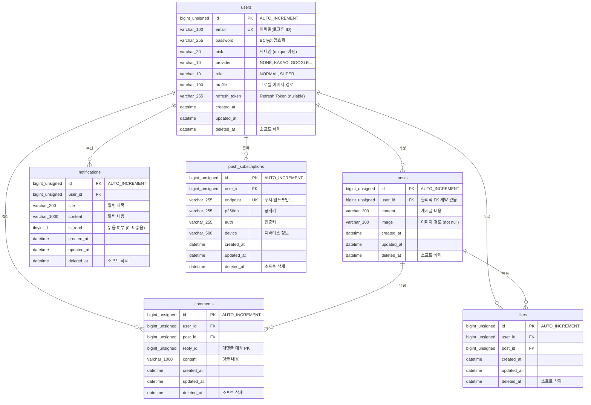

# 02. ERD & 데이터베이스

## 1. ERD 다이어그램



> **v1 (현재):** `users`, `posts` 테이블만 사용
> **v2 (예정, 미구현):** `comments`, `likes`, `notifications`, `push_subscriptions`는 설계안이며 코드(엔티티/테이블)에는 아직 존재하지 않는다.

---

## 2. 테이블 스키마

### 2-1. users

| 컬럼 | 타입 | NULL | 제약 | 설명 |
|------|------|------|------|------|
| `id` | BIGINT UNSIGNED | NO | PK, AUTO_INCREMENT | 유저 PK |
| `email` | VARCHAR(100) | NO | UNIQUE | 이메일 (로그인 ID) |
| `password` | VARCHAR(255) | NO | | BCrypt 암호화된 비밀번호 |
| `nick` | VARCHAR(20) | NO | | 닉네임 (unique 아님) |
| `provider` | VARCHAR(10) | NO | | 로그인 제공자 (`NONE`, `KAKAO`, `GOOGLE`) |
| `role` | VARCHAR(10) | NO | | 권한 (`NORMAL`, `SUPER`) |
| `profile` | VARCHAR(100) | NO | | 프로필 이미지 경로 |
| `refresh_token` | VARCHAR(255) | YES | | Refresh Token 저장소 |
| `created_at` | DATETIME | NO | | 생성 시각 (`@CreatedDate`가 자동 기록) |
| `updated_at` | DATETIME | NO | | 수정 시각 (`@LastModifiedDate`가 자동 기록) |
| `deleted_at` | DATETIME | YES | | 소프트 삭제 시각 |

> `refresh_token`을 DB에 저장하는 이유: 로그아웃 또는 강제 만료 시 DB의 값을 `NULL`로 업데이트해서 토큰을 무효화한다.

---

### 2-2. posts

| 컬럼 | 타입 | NULL | 제약 | 설명 |
|------|------|------|------|------|
| `id` | BIGINT UNSIGNED | NO | PK, AUTO_INCREMENT | 게시글 PK |
| `user_id` | BIGINT UNSIGNED | NO | FK 성격(→ users.id), **물리적 FK 제약 없음** | 작성자. 엔티티에 `@ForeignKey(ConstraintMode.NO_CONSTRAINT)`로 지정되어 있고, `updatable=false`라 작성 이후 수정 불가 |
| `content` | VARCHAR(200) | NO | | 게시글 내용 |
| `image` | VARCHAR(100) | NO | | 이미지 파일 경로 (엔티티상 not null) |
| `created_at` | DATETIME | NO | | 생성 시각 |
| `updated_at` | DATETIME | NO | | 수정 시각 |
| `deleted_at` | DATETIME | YES | | 소프트 삭제 시각 |

---

### 2-3. comments *(v2 예정)*

| 컬럼 | 타입 | NULL | 제약 | 설명 |
|------|------|------|------|------|
| `id` | BIGINT UNSIGNED | NO | PK, AUTO_INCREMENT | 댓글 PK |
| `user_id` | BIGINT UNSIGNED | NO | FK → users.id | 작성자 |
| `post_id` | BIGINT UNSIGNED | NO | FK → posts.id | 대상 게시글 |
| `content` | VARCHAR(1000) | NO | | 댓글 내용 |
| `reply_id` | BIGINT UNSIGNED | NO | | 대댓글 대상 댓글 PK (0이면 최상위 댓글) |
| `created_at` | DATETIME | YES | | 생성 시각 |
| `updated_at` | DATETIME | YES | | 수정 시각 |
| `deleted_at` | DATETIME | YES | | 소프트 삭제 시각 |

---

### 2-4. likes *(v2 예정)*

| 컬럼 | 타입 | NULL | 제약 | 설명 |
|------|------|------|------|------|
| `id` | BIGINT UNSIGNED | NO | PK, AUTO_INCREMENT | 좋아요 PK |
| `user_id` | BIGINT UNSIGNED | NO | FK → users.id | 누른 유저 |
| `post_id` | BIGINT UNSIGNED | NO | FK → posts.id | 대상 게시글 |
| `created_at` | DATETIME | YES | | 생성 시각 |
| `updated_at` | DATETIME | YES | | 수정 시각 |
| `deleted_at` | DATETIME | YES | | 소프트 삭제 시각 |

---

### 2-5. notifications *(v2 예정)*

| 컬럼 | 타입 | NULL | 제약 | 설명 |
|------|------|------|------|------|
| `id` | BIGINT UNSIGNED | NO | PK, AUTO_INCREMENT | 알림 PK |
| `user_id` | BIGINT UNSIGNED | NO | FK → users.id | 수신 유저 |
| `title` | VARCHAR(200) | NO | | 알림 제목 |
| `content` | VARCHAR(1000) | NO | | 알림 내용 |
| `is_read` | TINYINT(1) | NO | DEFAULT 0 | 읽음 여부 (0: 미읽음, 1: 읽음) |
| `created_at` | DATETIME | YES | | 생성 시각 |
| `updated_at` | DATETIME | YES | | 수정 시각 |
| `deleted_at` | DATETIME | YES | | 소프트 삭제 시각 |

---

### 2-6. push_subscriptions *(v2 예정)*

| 컬럼 | 타입 | NULL | 제약 | 설명 |
|------|------|------|------|------|
| `id` | BIGINT UNSIGNED | NO | PK, AUTO_INCREMENT | 구독 PK |
| `user_id` | BIGINT UNSIGNED | NO | FK | 등록 유저 |
| `endpoint` | VARCHAR(255) | NO | UNIQUE | 브라우저 푸시 엔드포인트 |
| `p256dh` | VARCHAR(255) | NO | | 공개키 |
| `auth` | VARCHAR(255) | NO | | 인증키 |
| `device` | VARCHAR(500) | NO | | 디바이스 정보 |
| `created_at` | DATETIME | YES | | 생성 시각 |
| `updated_at` | DATETIME | YES | | 수정 시각 |
| `deleted_at` | DATETIME | YES | | 소프트 삭제 시각 |

---

## 3. 테이블 간 관계 (FK)

| FK 이름 | 테이블 | 컬럼 | 참조 | ON DELETE |
|---------|--------|------|------|-----------|
| `fk_posts_user_id` | posts | user_id | users.id | CASCADE |
| `fk_comments_user_id` | comments | user_id | users.id | CASCADE |
| `fk_comments_post_id` | comments | post_id | posts.id | CASCADE |
| `fk_likes_user_id` | likes | user_id | users.id | CASCADE |
| `fk_likes_post_id` | likes | post_id | posts.id | CASCADE |
| `fk_notifications_user_id` | notifications | user_id | users.id | CASCADE |

> `ON DELETE CASCADE`: 부모 레코드(users, posts)가 삭제되면 자식 레코드도 자동으로 삭제된다.
> 단, 이 프로젝트에서는 실제 삭제 대신 소프트 삭제(`deleted_at`)를 사용하므로 CASCADE가 직접 발동하는 경우는 드물다.
>
> **주의**: `fk_posts_user_id`는 개념적인 관계일 뿐, 실제 `posts` 테이블에는 물리적 FK 제약이 없다.
> `Post` 엔티티의 `@JoinColumn`에 `foreignKey = @ForeignKey(ConstraintMode.NO_CONSTRAINT)`가 지정되어 있기 때문이다.
> `comments`/`likes`/`notifications` 관련 FK는 해당 테이블 자체가 아직 존재하지 않으므로 모두 설계안이다.

---

## 4. 소프트 삭제 패턴

모든 테이블에는 `deleted_at` 컬럼이 있다. 레코드를 실제로 `DELETE`하지 않고 `deleted_at`에 시각을 기록하는 방식으로 삭제를 처리한다.

Hibernate 6의 `@SQLDelete`/`@SQLRestriction` 어노테이션으로 소프트 삭제를 자동화한다. MyBatis 시절처럼 매 쿼리에 수동으로 `WHERE deleted_at IS NULL`을 추가할 필요가 없다.

**삭제 처리 및 조회 제외 (`Post` 엔티티)**
```java
@Entity
@Table(name = "posts")
@SQLDelete(sql = "UPDATE posts SET deleted_at = NOW() WHERE id = ?")   // repository.delete() 호출 시 물리 DELETE 대신 이 UPDATE가 실행된다
@SQLRestriction("deleted_at IS NULL")                                   // 모든 SELECT(QueryDSL 포함)에 자동으로 이 조건이 추가된다
public class Post {
    // ...
}
```

- `User` 엔티티도 동일한 패턴(`UPDATE users SET deleted_at = NOW() WHERE id = ?` / `deleted_at IS NULL`)을 사용한다.
- `postRepository.delete(post)`처럼 Spring Data JPA의 삭제 메서드를 호출해도 실제로는 UPDATE 문이 실행된다.
- `@SQLRestriction`이 붙어 있으므로 `postRepository.findById(id)`, QueryDSL의 `selectFrom(post)...` 등 모든 조회에 삭제된 레코드가 자동으로 제외된다.

**소프트 삭제의 장점**
- 실수로 삭제한 데이터를 복구할 수 있다
- 삭제 시각 기준의 통계나 감사(audit) 로그를 남길 수 있다
- 외래 키 관계가 깨지지 않아 데이터 정합성을 유지할 수 있다

---

## 5. JPA 엔티티 매핑 — DB ↔ Java 필드 매핑

DB 컬럼명은 `snake_case`, Java 필드명은 `camelCase`를 사용한다.
JPA는 `@Column(name = "...")`으로 컬럼명과 필드명을 명시적으로 연결한다.

**`User` 엔티티 — 필드 매핑 예시**
```java
@Entity
@EntityListeners(AuditingEntityListener.class)
@Table(name = "users")
public class User {
    @Id
    @GeneratedValue(strategy = GenerationType.IDENTITY)
    @Column(name = "id", columnDefinition = "BIGINT UNSIGNED")
    private Long id;

    @Column(name = "email", unique = true, nullable = false, length = 100)
    private String email;

    @Column(name = "nick", nullable = false, length = 20)
    private String nick;

    @Column(name = "refresh_token", nullable = true, length = 255)   // snake → camel
    private String refreshToken;

    @CreatedDate
    @Column(name = "created_at", nullable = false)                  // snake → camel
    private LocalDateTime createdAt;

    @LastModifiedDate
    @Column(name = "updated_at", nullable = false)
    private LocalDateTime updatedAt;

    @Column(name = "deleted_at", nullable = true)
    private LocalDateTime deletedAt;
}
```

**매핑 대응표 (users 기준)**

| DB 컬럼 (snake_case) | Java 필드 (camelCase) |
|----------------------|-----------------------|
| `refresh_token` | `refreshToken` |
| `created_at` | `createdAt` |
| `updated_at` | `updatedAt` |
| `deleted_at` | `deletedAt` |

**`@GeneratedValue(strategy = GenerationType.IDENTITY)` — INSERT 후 자동 PK 반환**

- `GenerationType.IDENTITY`: DB의 AUTO_INCREMENT 값을 PK로 사용하겠다는 선언
- Hibernate가 `save()` 실행 시 INSERT 문을 실행하고, DB가 생성한 PK를 엔티티의 `id` 필드에 자동으로 채워 넣는다
- 덕분에 `userRepository.save(user)` 직후 별도 SELECT 없이 `user.getId()`로 새 PK를 바로 사용할 수 있다
- `@CreatedDate`/`@LastModifiedDate`는 `@EnableJpaAuditing`(애플리케이션 클래스에 선언)이 활성화되어 있어야 자동으로 값이 채워진다
